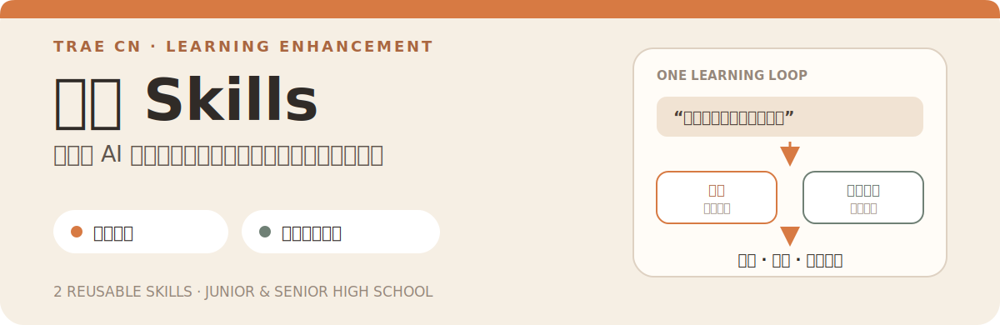
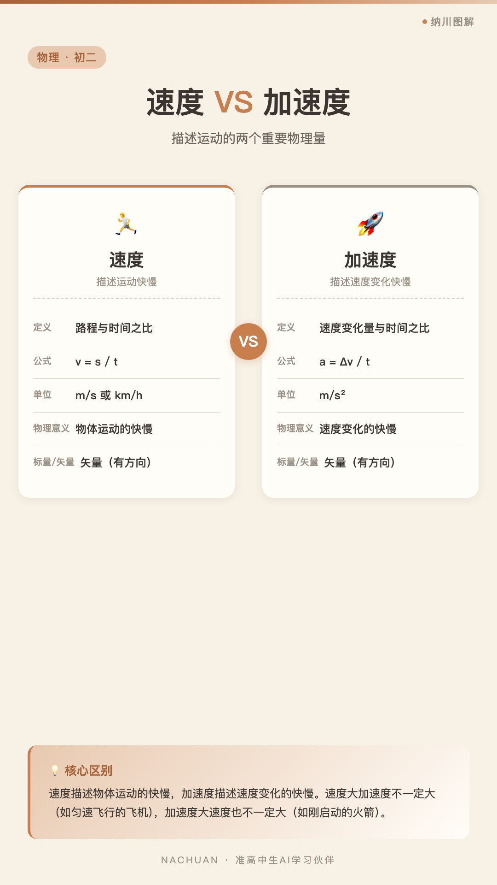
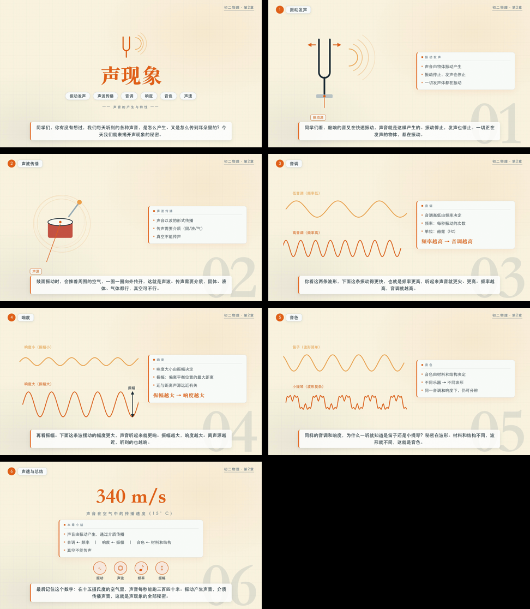

<p align="center">
  
</p>

给准高中生和家长的 AI 学习增强包。安装到 **TRAE CN** 后，用自然语言调用两个 Skill，把抽象知识做成可核对的图解和可回看的教学视频。

## 先看真实产物

<p align="center">
  <a href="./assets/showcase/nachuan-tujie-speed-vs-acceleration.png"></a>
  &nbsp;&nbsp;
  <a href="./assets/showcase/nachuan-teachingvideo-montage.png"></a>
</p>

这两张图来自仓库现有模板和示例的本机渲染结果，不是概念效果图。生成后的知识内容仍需孩子复述、练习并用教材核对。

## 一次安装，两种学习产出

| Skill | 你会得到 | 适合解决 |
|---|---|---|
| [`nachuan-tujie`](nachuan-tujie/SKILL.md) | 1080×1920 竖版 PNG 知识图 | 概念对比、公式、步骤、时间线、思维导图 |
| [`nachuan-teachingvideo`](nachuan-teachingvideo/SKILL.md) | 1080p 教学视频或无声循环 MP4 | 物理过程、实验、公式推导、概念辨析 |

覆盖语文、数学、英语、物理、化学、生物、政治、历史、地理和高中预科。它们是 TRAE 学习工作台里的长期增强能力，不替代孩子思考，也不替代教材和教师。

## 3 分钟，在 TRAE CN 里跑通第一次

### 第 1 步：安装两个 Skill

在 TRAE CN 的终端中复制：

```bash
npx -y skills add wilsondd-lab/nachuan-stu --skill '*' --agent trae-cn --global --yes --copy
```

Node.js 是本地运行环境，安装一次即可。若终端提示找不到 `node` 或 `npx`，先到 [Node.js 官网](https://nodejs.org/)安装 LTS 版本，再重新执行上面的命令。

### 第 2 步：验证安装

```bash
npx -y skills list --global --agent trae-cn
```

列表里应能看到：

- `nachuan-tujie`
- `nachuan-teachingvideo`

### 第 3 步：在 TRAE 里直接说

```text
用纳川图解，做一张“速度 vs 加速度”的初二物理知识图。
```

或者：

```text
用纳川教学视频，做一个“声现象”的 60 秒教学视频。
```

第一次调用时，Skill 会检查本机环境。图解基础模式需要 Node.js、npx 和本地渲染组件；教学视频还需要 ffmpeg。首次下载渲染依赖时需要可用网络。

## 生成只是中间步骤

```text
孩子先说自己的理解
    ↓
让 AI 整理图解提纲或视频脚本
    ↓
家长和孩子一起审内容
    ↓
生成图解或视频
    ↓
孩子看着成果复述
    ↓
做一道相似题并回教材核对
```

AI 生成不是终点。能复述、能练习、能核对，才算完成一次学习。

## 环境与兼容性

<details>
<summary><strong>展开环境检测命令</strong></summary>

### 图解环境

```bash
node --version
npx --version
npx hyperframes --version
```

### 教学视频环境

```bash
python3 nachuan-teachingvideo/scripts/render_video.py --check-env
```

2026-07-15 的本机实测环境为 Node.js `v22.22.3`、npx `10.9.8`、HyperFrames `0.7.58`、ffmpeg `8.1`。这只是一次实测记录，不是对所有电脑和未来版本的保证。

</details>

<details>
<summary><strong>只装一个 Skill、克隆仓库或移除</strong></summary>

### 只安装图解

```bash
npx -y skills add wilsondd-lab/nachuan-stu --skill nachuan-tujie --agent trae-cn --global --yes --copy
```

### 只安装教学视频

```bash
npx -y skills add wilsondd-lab/nachuan-stu --skill nachuan-teachingvideo --agent trae-cn --global --yes --copy
```

### 直接克隆仓库

```bash
git clone https://github.com/wilsondd-lab/nachuan-stu.git
```

### 更新与移除

重新执行安装命令即可拉取当前仓库版本。需要移除时，先用 `skills list` 确认安装位置，再删除对应的全局 Skill；不同版本的 Skills CLI 参数可能变化，以命令行帮助为准。

</details>

<details>
<summary><strong>仓库目录</strong></summary>

```text
nachuan-stu/
├── nachuan-tujie/             # 知识图解 Skill
├── nachuan-teachingvideo/     # 教学视频 Skill
├── assets/readme/             # GitHub 首图
├── assets/showcase/           # 真实产物预览
└── update_scripts/            # 维护工具脚本
```

</details>

## 与《准高中生 AI 橙皮书》的关系

《准高中生 AI 橙皮书》以 TRAE CN 为 21 次亲子练习的主要工作台。纳川图解和纳川教学视频安装一次后，可以在不同学科反复调用，把一次对话继续变成能保存、复述和回看的学习资料。

